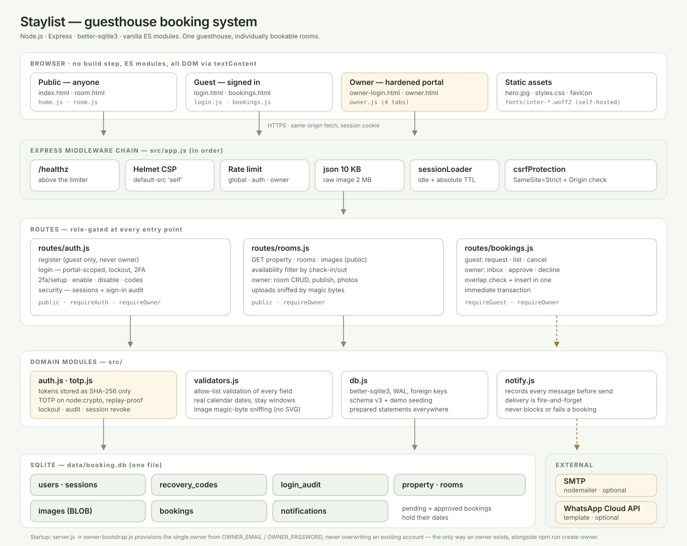

# Staylist — guesthouse booking site

An Airbnb-style booking site for a **single guesthouse with individually bookable rooms**. Visitors browse the place, its rooms, photos, prices and the owner's contact details with no account at all. Guests sign in to request a room for a date range. The owner signs in through a separate, hardened portal to manage rooms and approve requests.

## Stack

- **Backend:** Node.js (≥18), Express, better-sqlite3 (SQLite)
- **Frontend:** Vanilla HTML/CSS/ES modules, served statically
- **Auth:** Server-side sessions (hashed tokens, HttpOnly cookies) with TOTP two-factor for the owner

## Architecture



Requests flow top to bottom: the browser talks to one Express app, every request passes the same middleware chain (CSP → rate limit → body caps → session → CSRF) before any route sees it, routes are role-gated at the entry point, and all persistence is a single SQLite file. Notification delivery hangs off to the side deliberately — it is fire-and-forget, so a slow or unconfigured provider can never delay or fail a booking.

The diagram is an SVG (`docs/architecture.svg`), so it is diffable and editable rather than a screenshot.

## Getting started

```bash
npm install
npm start          # serves http://127.0.0.1:3000
```

The database is created in `data/` and seeded with an example guesthouse and four rooms so the site isn't empty. Set `SEED_DEMO=0` to skip that. **Seed data ships no usable credentials.**

Create the owner account — there are exactly two ways one comes into existence, both server-side:

```bash
# One-off, with shell access. Re-running rotates the password and signs out
# every device, which doubles as the password-reset path.
OWNER_EMAIL=you@example.com OWNER_PASSWORD='a-strong-password-12+' npm run create-owner

# Or set the same variables in the server's environment: the account is
# provisioned automatically at startup. This is the supported path on hosts
# without shell access (e.g. Render's free tier), and it recreates the
# account on every restart when the filesystem is ephemeral.
```

Startup provisioning never overwrites an existing account, so a routine redeploy cannot clobber a password you changed in the UI. To force a reset from the environment, set `OWNER_FORCE_RESET=1` for one deploy and remove it again (while it is set, every restart rotates the password and revokes all sessions).

Then sign in at `/owner-login.html` and turn on two-factor authentication under **Security**.

Run the test suite (52 tests, mostly security regression tests):

```bash
npm test
```

## How it works

**Visitors (no account)** land on the guesthouse page: gallery, description, house rules, owner contact details, and the room list. They search *check-in → check-out → guests*, and rooms already taken for those nights disappear from the results; the rest are quoted for the whole stay.

**Guests** register at `/login.html`, pick a room and dates, and submit a request with an optional message. `/bookings.html` shows each request's status — awaiting approval, confirmed, or declined — and reveals the address and arrival times once confirmed.

**The owner** manages everything from `/owner.html`, in four tabs:
- **Requests** — approve or decline each booking with a note to the guest
- **Rooms** — add, edit, publish/unpublish and delete rooms; set price, capacity, description; upload and delete photos
- **The place** — name, tagline, about, location, address, contact details, check-in/out times, house rules, and the gallery
- **Security** — two-factor setup, recovery codes, password change, signed-in devices, and recent sign-in activity

Rooms are unique units: once a room is held for a night, nobody else can take it. A **pending request holds its dates**, so the owner is never asked to approve two guests for the same room and nights; declining releases them again.

## Booking notifications

When a request arrives, the owner is alerted by **email and WhatsApp**. Every message is recorded in the database *before* delivery is attempted, so a request is never lost if a provider is down or unconfigured — the dashboard is always the source of truth. Delivery is fire-and-forget and can never delay or fail a guest's booking.

Transports activate purely from environment variables:

| Channel | Variables |
|---|---|
| Email | `SMTP_HOST`, `SMTP_PORT`, `SMTP_USER`, `SMTP_PASS`, `SMTP_FROM` |
| WhatsApp | `WHATSAPP_TOKEN`, `WHATSAPP_PHONE_NUMBER_ID`, plus `WHATSAPP_TEMPLATE_NAME` |
| Override recipients | `NOTIFY_EMAIL`, `NOTIFY_PHONE` (default to the property's contact details) |

A booking alert is business-initiated, so Meta requires an **approved message template** to reach you outside a 24-hour reply window — set `WHATSAPP_TEMPLATE_NAME` to a Utility template whose body has five placeholders, in this order: guest name, room, check-in, check-out, total. Without a template the code falls back to plain text, which only lands inside that window. The guest is emailed when their request is approved or declined.

## API

| Method | Path | Access | Description |
|---|---|---|---|
| GET | `/api/property` | public | The guesthouse and its gallery |
| GET | `/api/rooms` | public | Rooms, filterable by `checkIn`/`checkOut`/`guests` |
| GET | `/api/rooms/:id` | public | Room detail, photos, held dates |
| GET | `/api/images/:id` | public | Serve a photo |
| POST | `/api/auth/register` | public | Create a **guest** account (never an owner) |
| POST | `/api/auth/login` | public | Sign in via the `guest` or `owner` portal |
| POST | `/api/auth/logout` | any | Sign out |
| GET | `/api/auth/me` | public | Current user, or `null` |
| POST | `/api/auth/change-password` | any | Change password, revokes all sessions |
| POST | `/api/auth/2fa/setup` · `/enable` · `/disable` | owner | Two-factor enrolment and removal |
| POST | `/api/auth/2fa/recovery-codes` | owner | Regenerate recovery codes |
| GET | `/api/auth/security` | owner | 2FA state, sessions, sign-in audit |
| DELETE | `/api/auth/sessions/:id` | owner | Revoke one device |
| POST | `/api/auth/sessions/revoke-others` | owner | Sign out everywhere else |
| POST | `/api/bookings` | guest | Request a room |
| GET | `/api/bookings` | guest | Own requests and stays |
| DELETE | `/api/bookings/:id` | guest | Withdraw or cancel own booking |
| GET | `/api/owner/bookings` | owner | Approval inbox, filterable by status |
| POST | `/api/owner/bookings/:id/approve` · `/decline` | owner | Decide a request |
| PATCH | `/api/owner/property` | owner | Edit the guesthouse |
| GET/POST | `/api/owner/rooms` | owner | List / create rooms |
| PATCH/DELETE | `/api/owner/rooms/:id` | owner | Edit / delete a room |
| POST | `/api/owner/rooms/:id/images` | owner | Upload a room photo (raw image body) |
| POST | `/api/owner/property/images` | owner | Upload a gallery photo |
| DELETE | `/api/owner/images/:id` | owner | Delete a photo |
| GET | `/api/owner/notifications` | owner | Notification history and transport status |

Stays may start up to 365 days ahead and run up to 60 nights.

## Security design

Every item below is covered by a regression test.

### The owner account

The owner account controls the whole guesthouse, so it is hardened well past the guest accounts:

- **No self-registration.** Registration always produces a guest, whatever the request body claims. The owner exists only via `npm run create-owner` or the server's own environment variables at startup, so no network path can mint one.
- **Two-factor authentication (TOTP)** compatible with any authenticator app, implemented on Node's own crypto — it adds no third-party dependency to the supply chain. Codes are compared in constant time, accepted within one 30-second step either side for clock drift, and **cannot be replayed**: the consumed step is recorded, so a code observed over the shoulder or in a log is dead inside its own window.
- **Single-use recovery codes** (8, shown once, stored only as bcrypt hashes) so a lost phone cannot lock the owner out permanently.
- **Disabling two-factor requires the password**, so a stolen session alone cannot strip the second factor. Enabling it revokes all other sessions.
- **Per-account lockout with doubling backoff** (5 failures → 15 min, doubling to a 6-hour cap) *on top of* the per-IP rate limit, which a rotating-IP attacker could otherwise sidestep. Locks always expire, so an attacker cannot permanently deny the owner access. A locked account is refused before the password is even checked.
- **A separate, tighter rate limit** on the owner portal specifically.
- **Short sessions:** 2 hours idle and 12 hours absolute for the owner, versus 7/30 days for guests — both enforced server-side, and the idle window can never slide past the absolute deadline.
- **`__Host-` cookie prefix in production**, so the session cookie cannot be overwritten by a subdomain.
- **Session visibility and remote revoke:** every signed-in device with its IP, user agent and last-seen time, revocable individually or all at once. Revocation is scoped to the caller's own user id.
- **A sign-in audit trail** (IP, device, outcome) surfaced in the dashboard, so an intrusion attempt is visible rather than silent.
- **A stronger password policy** (12+ characters, two character classes, common passwords refused).
- **Portal isolation:** the owner cannot sign in through the guest portal and vice versa, and using the wrong portal returns *exactly* the same error as a wrong password — so the portals cannot be used to discover which address is the owner's.

### Everything else

- **SQL injection** — every query uses prepared statements with bound parameters; no string-built SQL anywhere. Status filters are checked against an allow-list.
- **XSS** — the frontend builds all DOM through `textContent`/`createTextNode` and never uses `innerHTML`, so room text cannot become markup. A strict CSP (`default-src 'self'`, no inline scripts) enforces it a second time.
- **Malicious uploads** — photos are accepted only after the real type is confirmed by **magic-byte sniffing**, never the declared `Content-Type`. SVG is deliberately unsupported because it can carry script. Capped at 2 MB and 20 photos per gallery, served with the sniffed type plus `nosniff`.
- **Broken access control** — each route names exactly which roles may reach it. Guests cannot touch owner endpoints, cannot approve their own bookings, and the owner cannot book through the guest route.
- **IDOR** — bookings are scoped to the signed-in guest in the `WHERE` clause; another guest's booking returns 404 rather than 403, so its existence is never confirmed.
- **CSRF** — `SameSite=Strict` cookies plus an `Origin`/`Referer` check on every state-changing request.
- **Session hijacking** — 256-bit tokens stored server-side only as SHA-256 hashes, so a database leak yields no usable session.
- **User enumeration** — login compares against a dummy bcrypt hash when the account doesn't exist, keeping timing and responses identical.
- **Price tampering** — totals are computed server-side from the stored nightly rate; a client-sent price is ignored. Money is integer-only, so totals cannot drift through floating-point rounding.
- **Double booking** — the availability check and insert run in one immediate transaction; concurrent requests for the same nights cannot both succeed. Same-day changeover is allowed by design.
- **Double approval** — deciding a request is atomic and only applies to a pending one, so a double-click cannot approve twice or race a decline.
- **Open redirect** — the post-login `?next=` is honoured only for same-origin relative paths.
- **Data loss** — deleting a room with live bookings is refused; unpublishing hides it without destroying stays guests rely on.
- **DoS** — rate limiting everywhere, JSON bodies capped at 10 KB, uploads at 2 MB.
- **Information leakage** — a central error handler returns generic messages and logs details server-side only; `X-Powered-By` off; Helmet sets CSP, `nosniff`, `frame-ancestors 'none'` and a no-referrer policy.
- **Secrets** — none in the codebase; all credentials come from the environment; `data/` and `.env` are git-ignored.

For production, run behind TLS (the `Secure` and `__Host-` cookie behaviour activates with `NODE_ENV=production`) and set `TRUST_PROXY=1` behind a single reverse proxy so secure cookies and per-client rate limiting work correctly.

## Deploying

[](https://render.com/deploy?repo=https://github.com/nonuprateek1996-ai/Booking-system)

**Render (one click, free):** the button reads `render.yaml` and deploys automatically. The blueprint prompts for `OWNER_EMAIL` and `OWNER_PASSWORD` at deploy time (they're marked `sync: false`, so they are never stored in the repository), and the owner account is provisioned from them at startup — no shell access needed. On the free plan the SQLite file is ephemeral — rooms, photos, bookings and 2FA enrolment reset on redeploy, and the owner account is recreated automatically from those variables. Attach a persistent disk mounted at `/data` and set `DATA_DIR=/data` (paid plans) to keep data permanently.

**Custom domain:** the blueprint claims `colonelsparadisebir.com` and `www.colonelsparadisebir.com`, and sets `CANONICAL_HOST` so every other name Render routes to the service — the apex, the old `.onrender.com` URL — redirects to `www.colonelsparadisebir.com` with a `308`. Render issues and renews the TLS certificate once DNS resolves. `CANONICAL_HOST` must point the same way as Render's own apex/www redirect or requests loop between the two; the registrar-side records, that constraint and the verification steps are in [docs/custom-domain.md](docs/custom-domain.md). Leaving `CANONICAL_HOST` unset disables the redirect, which is how local development runs on `localhost`.

**Any Docker host** (Railway, Fly.io, a VPS) — a production `Dockerfile` is included:

```bash
docker build -t booking-system .
docker run -p 3000:3000 -v booking-data:/data booking-system
```

Photos live in the database, so a persistent volume keeps images as well as bookings.
